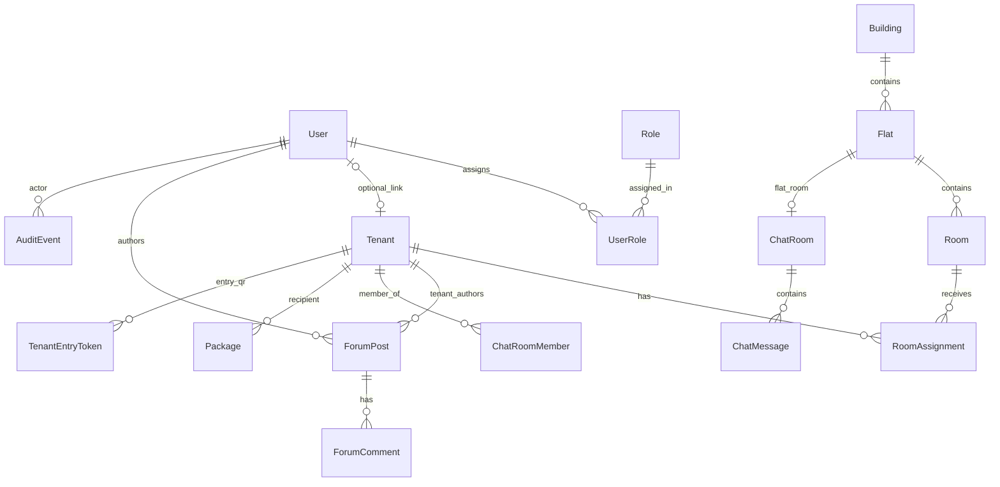
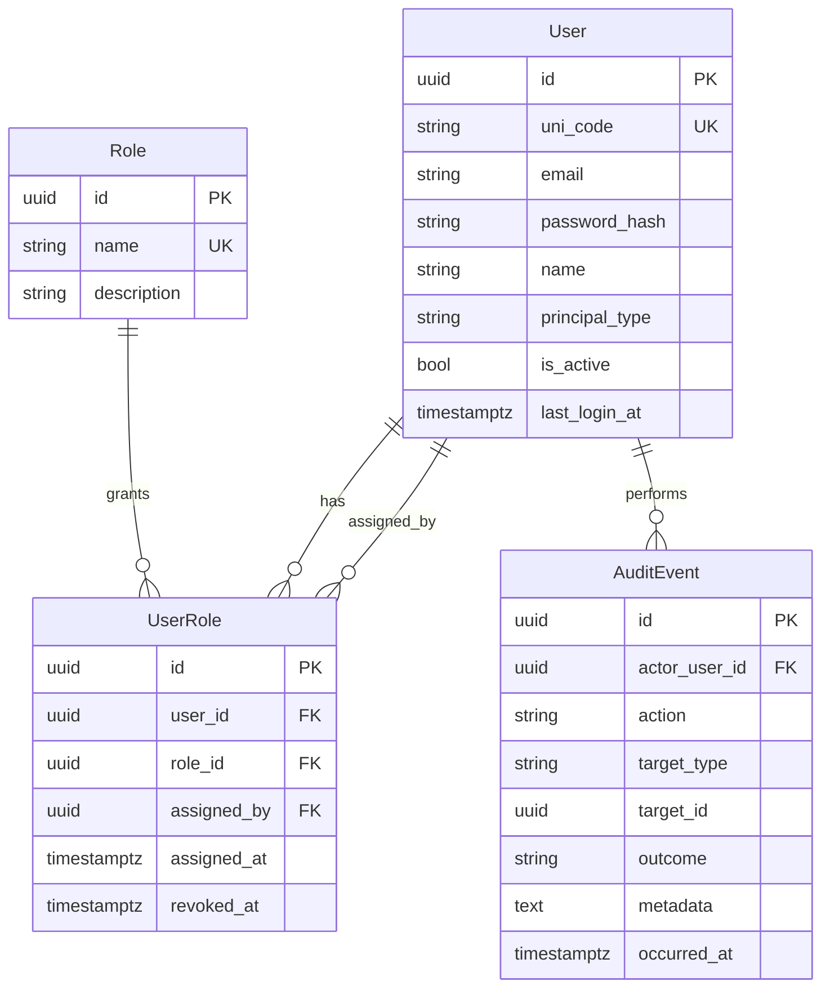
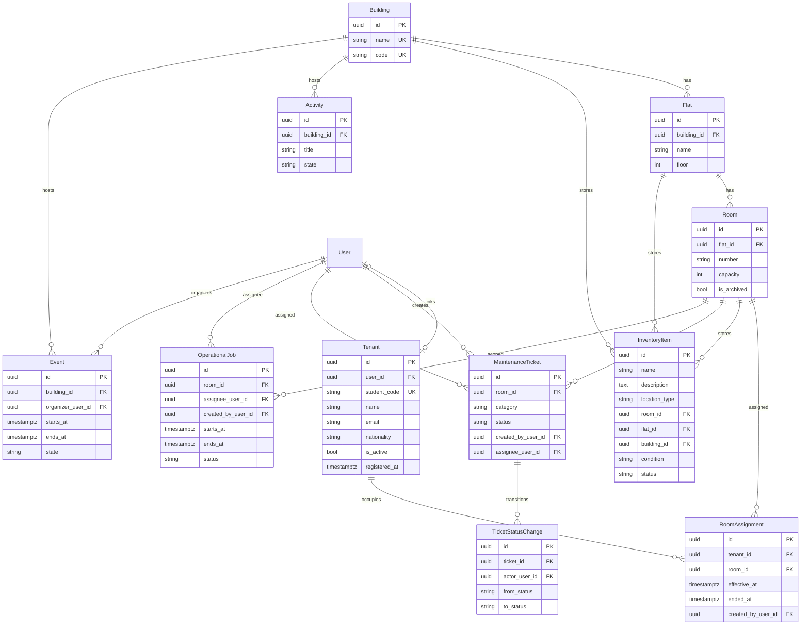
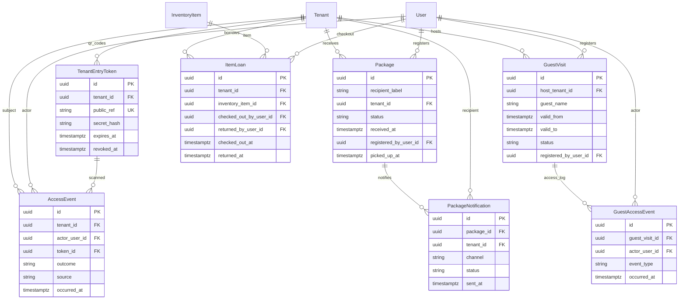

# Database documentation

Module-scoped relational design: tables (and views) each module owns or depends on, column purposes, keys, and **cross-module dependencies**. Aligns with the matching [specifications](../specifications/) and [requirements](../requirements/) documents.

## Module documents

| Document | Module | Specification |
|----------|--------|---------------|
| [administration.md](administration.md) | Administration and Office | [administration-office.md](../specifications/administration-office.md) |
| [doorman.md](doorman.md) | Doorman operations | [doorman.md](../specifications/doorman.md) |
| [forum.md](forum.md) | Tenant forum | [forum.md](../specifications/forum.md) |
| [chat.md](chat.md) | Tenant chat | [chat.md](../specifications/chat.md) |
| [platform.md](platform.md) | Platform / cross-cutting | [platform.md](../specifications/platform.md) |

Each module document includes scope (owned vs. read-only tables) and a **Cross-Module Dependencies** (or boundaries) section.

## Entity-relationship diagram

Diagrams reflect GORM models under [`internal/models/`](../../internal/models/). All entities embed `id`, `created_at`, `updated_at`, and soft-delete `deleted_at` via `platform.BaseModel` unless noted. Table names follow GORM’s default pluralized snake_case.

**Migration order:** administration → forum → chat → doorman ([`internal/app/app.go`](../../internal/app/app.go)).

### Complete database (all tables)

Single diagram of every migrated entity and declared foreign-key relationship. Polymorphic associations (`ForumReaction`, `ForumModerationAction`, `AuditEvent.target_type`) are drawn to their primary target types; the database does not enforce those FKs.

```mermaid
erDiagram
  User ||--o{ UserRole : has
  Role ||--o{ UserRole : grants
  User |o--o{ UserRole : assigned_by
  User |o--o| Tenant : links
  User |o--o{ AuditEvent : actor

  Building ||--o{ Flat : contains
  Flat ||--o{ Room : contains
  Tenant ||--o{ RoomAssignment : assigned
  Room ||--o{ RoomAssignment : receives
  User ||--o{ RoomAssignment : created_by

  Building ||--o{ InventoryItem : locates
  Flat ||--o{ InventoryItem : locates
  Room ||--o{ InventoryItem : locates
  Room |o--o{ MaintenanceTicket : room
  User ||--o{ MaintenanceTicket : created_by
  User |o--o{ MaintenanceTicket : assignee
  MaintenanceTicket ||--o{ TicketStatusChange : history
  User ||--o{ TicketStatusChange : actor

  Room |o--o{ OperationalJob : room
  User ||--o{ OperationalJob : assignee
  User |o--o{ OperationalJob : created_by

  Building |o--o{ Activity : building
  Building |o--o{ Event : building
  User ||--o{ Event : organizer

  User ||--o{ ForumPost : author_user
  Tenant |o--o{ ForumPost : author_tenant
  Activity |o--o{ ForumPost : mirrors
  Event |o--o{ ForumPost : mirrors
  ForumPost ||--o| ForumPostSchedule : schedule
  ForumPost ||--o{ ForumPostUpdate : updates
  User ||--o{ ForumPostUpdate : author
  ForumPost ||--o| ForumPoll : poll
  User ||--o{ ForumPoll : created_by
  ForumPoll ||--o{ ForumPollOption : options
  ForumPoll ||--o{ ForumPollVote : votes
  ForumPollOption ||--o{ ForumPollVote : option
  Tenant ||--o{ ForumPollVote : voter
  ForumPost ||--o{ ForumComment : comments
  User ||--o{ ForumComment : author
  ForumComment |o--o{ ForumComment : replies
  User ||--o{ ForumReaction : user
  ForumPost ||--o{ ForumReaction : target_post
  ForumComment ||--o{ ForumReaction : target_comment
  ForumPost ||--o{ ForumAttendanceIntent : attendance
  Tenant ||--o{ ForumAttendanceIntent : tenant
  ForumPost ||--o{ ForumPostView : views
  User |o--o{ ForumPostView : viewer_user
  Tenant |o--o{ ForumPostView : viewer_tenant
  User ||--o{ ForumModerationAction : moderator
  ForumPost ||--o{ ForumModerationAction : target_post
  ForumComment ||--o{ ForumModerationAction : target_comment

  Flat |o--o| ChatRoom : flat_room
  Tenant |o--o{ ChatRoom : direct_pair
  ChatRoom ||--o{ ChatRoomMember : members
  Tenant ||--o{ ChatRoomMember : member
  ChatMessage |o--o{ ChatRoomMember : last_read
  ChatRoom ||--o{ ChatMessage : messages
  Tenant ||--o{ ChatMessage : author
  Tenant ||--|| ChatTenantProfile : profile
  Tenant ||--o{ ChatMembershipSyncLog : sync
  Flat ||--o{ ChatMembershipSyncLog : sync

  Tenant ||--o{ TenantEntryToken : qr
  Tenant |o--o{ Package : recipient
  User |o--o{ Package : registered_by
  User |o--o{ Package : picked_up_by
  Package ||--o{ PackageNotification : notifies
  Tenant ||--o{ PackageNotification : tenant

  Tenant ||--o{ GuestVisit : host
  User |o--o{ GuestVisit : registered_by
  GuestVisit ||--o{ GuestAccessEvent : events
  User ||--o{ GuestAccessEvent : actor

  Tenant |o--o{ AccessEvent : tenant
  User |o--o{ AccessEvent : actor
  TenantEntryToken |o--o{ AccessEvent : token

  Tenant ||--o{ ItemLoan : borrower
  InventoryItem ||--o{ ItemLoan : item
  User ||--o{ ItemLoan : checked_out_by
  User |o--o{ ItemLoan : returned_by
```



Scroll or zoom in your Markdown preview if the diagram is large. For readable slices by domain, see the sections below.

### Overview (modules and hub entities)



### Identity and RBAC (administration)

`User`, `Role`, and `UserRole` are defined in [`internal/models/administration/user.go`](../../internal/models/administration/user.go) and migrated with administration models.



### Housing, tenants, and operations (administration)



### Forum

`PublicationState` is shared with administration via [`platform.PublicationState`](../../internal/models/platform/publication_state.go). Polymorphic rows (`ForumReaction`, `ForumModerationAction`) reference targets by `target_type` + `target_id` without database FK enforcement.

```mermaid
erDiagram
  ForumPost {
    uuid id PK
    uuid author_user_id FK
    uuid author_tenant_id FK
    uuid activity_id FK
    uuid event_id FK
    string kind
    string title
    text body
    string state
    string source
    timestamptz published_at
  }
  ForumPostSchedule {
    uuid id PK
    uuid forum_post_id FK UK
    timestamptz starts_at
    timestamptz ends_at
    string location
  }
  ForumPostUpdate {
    uuid id PK
    uuid parent_post_id FK
    uuid author_user_id FK
    text body
  }
  ForumPoll {
    uuid id PK
    uuid forum_post_id FK UK
    uuid created_by_user_id FK
    timestamptz closes_at
  }
  ForumPollOption {
    uuid id PK
    uuid poll_id FK
    string label
    int sort_order
  }
  ForumPollVote {
    uuid id PK
    uuid poll_id FK
    uuid option_id FK
    uuid tenant_id FK
    timestamptz voted_at
  }
  ForumComment {
    uuid id PK
    uuid post_id FK
    uuid author_user_id FK
    uuid parent_comment_id FK
    text body
    string moderation_state
  }
  ForumReaction {
    uuid id PK
    uuid user_id FK
    string target_type
    uuid target_id
    string reaction_type
  }
  ForumAttendanceIntent {
    uuid id PK
    uuid post_id FK
    uuid tenant_id FK
    string intent
  }
  ForumPostView {
    uuid id PK
    uuid post_id FK
    uuid viewer_user_id FK
    uuid viewer_tenant_id FK
    timestamptz viewed_at
  }
  ForumModerationAction {
    uuid id PK
    uuid moderator_user_id FK
    string target_type
    uuid target_id
    string action
    timestamptz occurred_at
  }

  User ||--o{ ForumPost : authors
  Tenant ||--o{ ForumPost : tenant_authors
  Activity ||--o{ ForumPost : mirrored
  Event ||--o{ ForumPost : mirrored
  ForumPost ||--|| ForumPostSchedule : schedule
  ForumPost ||--o{ ForumPostUpdate : updates
  ForumPost ||--|| ForumPoll : poll
  ForumPoll ||--o{ ForumPollOption : options
  ForumPoll ||--o{ ForumPollVote : votes
  Tenant ||--o{ ForumPollVote : casts
  ForumPost ||--o{ ForumComment : comments
  ForumComment ||--o{ ForumComment : replies
  User ||--o{ ForumComment : writes
  User ||--o{ ForumReaction : reacts
  ForumPost ||--o{ ForumAttendanceIntent : rsvp
  Tenant ||--o{ ForumAttendanceIntent : intends
  ForumPost ||--o{ ForumPostView : viewed
  User ||--o{ ForumModerationAction : moderates
```

### Chat

```mermaid
erDiagram
  ChatRoom {
    uuid id PK
    string kind
    string title
    uuid flat_id FK UK
    uuid tenant_low_id FK
    uuid tenant_high_id FK
    timestamptz last_message_at
  }
  ChatTenantProfile {
    uuid id PK
    uuid tenant_id FK UK
    string nickname
    text bio
    string avatar_storage_key
  }
  ChatMessage {
    uuid id PK
    uuid room_id FK
    uuid author_tenant_id FK
    text body
    uuid client_message_id
  }
  ChatRoomMember {
    uuid id PK
    uuid room_id FK
    uuid tenant_id FK
    string role
    timestamptz joined_at
    timestamptz left_at
    uuid last_read_message_id FK
    string source
  }
  ChatMembershipSyncLog {
    uuid id PK
    uuid tenant_id FK
    uuid flat_id FK
    string event_type
    timestamptz applied_at
    jsonb payload
  }

  Flat ||--o| ChatRoom : flat_chat
  Tenant ||--o{ ChatRoom : direct_low
  Tenant ||--o{ ChatRoom : direct_high
  ChatRoom ||--o{ ChatRoomMember : members
  Tenant ||--o{ ChatRoomMember : joins
  ChatRoom ||--o{ ChatMessage : messages
  Tenant ||--o{ ChatMessage : authors
  ChatMessage ||--o{ ChatRoomMember : read_cursor
  Tenant ||--|| ChatTenantProfile : profile
  Tenant ||--o{ ChatMembershipSyncLog : sync
  Flat ||--o{ ChatMembershipSyncLog : sync
```

### Doorman

Go type `Package` maps to table `packages`.



### Cross-module reference (external entities in diagrams)

| Entity | Defined in | Referenced by |
|--------|------------|---------------|
| `User`, `Role`, `UserRole` | administration | forum, chat (audit), doorman |
| `Tenant`, `Flat`, `Room`, `Building` | administration | forum, chat, doorman |
| `Activity`, `Event` | administration | forum (`ForumPost` mirror FKs) |
| `InventoryItem` | administration | doorman (`ItemLoan`) |
| `AuditEvent` | administration | all modules (append-only log) |

### Legend

| Symbol | Meaning |
|--------|---------|
| `PK` | Primary key (`id`, UUID) |
| `FK` | Foreign key to another table |
| `UK` | Unique constraint |
| `\|\|--\|\|` | One-to-one |
| `\|\|--o{` | One-to-many |

Partial unique indexes (not shown as separate entities): active `RoomAssignment` per tenant (`ended_at IS NULL`), active `ChatRoomMember` per room (`left_at IS NULL`).

## Conventions

- PostgreSQL-oriented naming; migrations may use snake_case columns.
- Identity, RBAC, and `AuditEvent` are defined in [platform.md](platform.md); product modules reference them rather than redefining them.
- Housing and assignment tables in administration drive forum visibility and chat flat-room membership as described in those modules’ boundary sections.

## Related documentation

- [Specifications](../specifications/) — domain invariants and integration contracts
- [Requirements](../requirements/) — `FR-*` traceability to tables where noted
- [internal/models/](../../internal/models/) — GORM model source of truth
