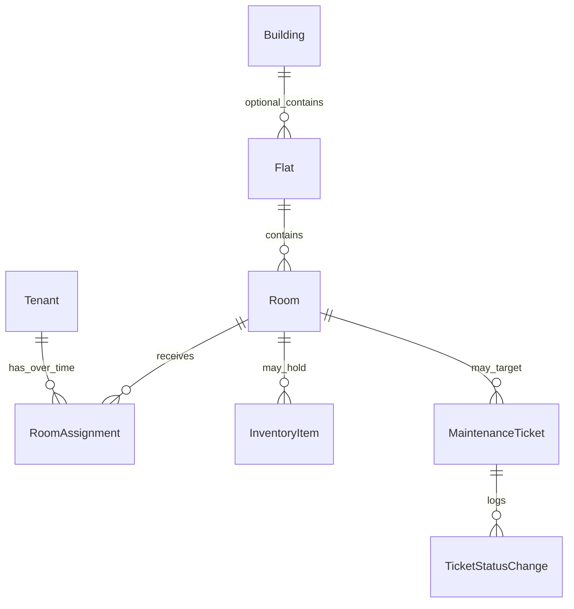
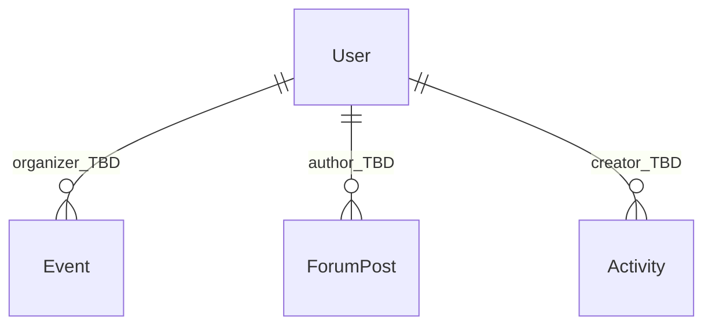

# Administration and Office — database tables

This document declares relational tables **relevant to the Administration and Office module**: purpose, primary and foreign keys, and integrity notes. It targets PostgreSQL and aligns with [data-model.md](../specifications/data-model.md), [glossary.md](../specifications/glossary.md), and administration user stories (AO-001–AO-006). Implementation may use equivalent naming (snake_case columns) in migrations.

---

## Scope

### Tables this module owns or primarily writes

Lifecycle and operational data for housing assignment, inventory, maintenance, and (when implemented) staff scheduling and official communications that originate from staff workflows.

### Tables this module reads or shares (boundaries)

| Area | Relationship |
|------|----------------|
| **Forum** | Official news and published activities appear in the tenant forum; see [Forum linkage](#forum-linkage-news-and-activities). |
| **Chat** | Flat auto-rooms and membership are **derived** from `Room` / `RoomAssignment` / `Flat`; administration does not own `ChatRoom` or `ChatMembership` but changes assignments drive chat membership. |
| **Doorman** | `Package`, `GuestAccess`, and lending flows are doorman-owned; administration may read tenant/room context only where product requires it. |
| **Platform** | `AuditEvent` and identity/RBAC tables are cross-cutting; administration emits or depends on them for sensitive actions. |

---

## Identity and RBAC (platform dependency)

Administration UIs and APIs require authenticated **staff** principals with **Administrator** or **Office Worker** roles (see [roles-and-permissions.md](../requirements/roles-and-permissions.md)). Concrete table names are not fixed in DM-01; expect something along these lines:

- **`User`** (or split **StaffUser** / **TenantUser**): unique identity, authentication linkage.
- **`Role`** and **`UserRole`** (or enum on user): maps users to `Administrator`, `Office Worker`, etc.

**Foreign keys:** history rows (`RoomAssignment`, `TicketStatusChange`, `AuditEvent`, `ForumPost.author_id`, job assignee) should reference stable user IDs. Mark as **TBD** until auth schema is committed.

---

## Core housing and occupancy

### `Building` (optional, Phase 1)

| | |
|--|--|
| **Purpose** | Physical dormitory grouping when multi-building deployments need it; may be omitted for single-site v1. |
| **Primary key** | `id` |
| **Relationships** | One building has many flats: **`Flat.building_id`** → `Building.id` (nullable if deferred). One building could host many asctivities: **`Activity.location`** → `Building.id`|

### `Flat`

| | |
|--|--|
| **Purpose** | Shared living unit containing one or more rooms; drives flatmate grouping and exactly one auto flat chat room (product rule). |
| **Primary key** | `id` |
| **Foreign keys** | Optional **`building_id`** → `Building.id`. |
| **Floor** | Important for the room assignement preferences (accessability, preferences). |
| **Integrity** | Exactly one `ChatRoom` with `kind = flat` and `flat_id` per flat (owned by chat provisioning, not admin CRUD). |

**Maps to:** AO-001 (room list by flat), glossary “Flat”.

### `Room`

| | |
|--|--|
| **Purpose** | Assignable unit for occupancy, inventory, and maintenance location; belongs to exactly one flat. |
| **Primary key** | `id` |
| **Foreign keys** | **`flat_id`** → `Flat.id` (required). |
| **Capacity** | Needs to be registered, when the application is built for a specific dormatory. |
| **Integrity** | Every room belongs to one flat; capacity enforced when creating/updating `RoomAssignment`. |

**Maps to:** AO-001, AO-002, AO-003.

### `Tenant`

| | |
|--|--|
| **Purpose** | Resident identity and profile data required for assignments and communications. |
| **Primary key** | `id` |
| **Relationships** | Many **`RoomAssignment`** rows over time; at most one **active** assignment at a time (application constraint + partial unique index recommended). |
| **Degree** | Important for the room assignments preferences. Null if finished or left the uiniversity. (BSc, BA, MSc, MA, PhD). |
| **Faculty** | Important for the room assignments preferences. Null if finished or left the uiniversity. Students attending the same faculty are more likely to live together. |
| **Age** | Important for the room assignments preferences. Preferably every flat has at least 1 senior student. Other age groups are distributed evenly. |
| **Sex** | Important for the room assignments preferences. Females live only with females and males with males.|
| **Nationality** | Important for the room assignments preferences. Hungarians only get rooms with Hungarians, other nations are considered international and get room assignments with internationals.|
| **Notes** | Student Consult Organizer and other tenant-scoped grants are capability flags or join tables on tenant; see roles spec. |

**Maps to:** AO-002, FR-01.

### `RoomAssignment`

| | |
|--|--|
| **Purpose** | Links a tenant to a room for a period; drives occupancy counts and flat chat membership (via room’s flat). |
| **Primary key** | `id` |
| **Foreign keys** | **`tenant_id`** → `Tenant.id`, **`room_id`** → `Room.id`. |
| **Integrity** | At most one row per tenant with **`ended_at` IS NULL** (active). Sum of active assignments per room ≤ `Room.capacity`. |

**Maps to:** AO-002 (assignment blocked when full), UC-AO-01.

#### Assignment history (AO-002)

A **single temporal table** `RoomAssignment` with **`effective_at`**, **`ended_at`** (nullable = active), **`created_by_user_id`**, instead of a separate “history only” table. Created every semester.

- **Why:** one query model for “current occupant” and “who was here when”; append-only style by ending the previous row and inserting a new active row (or updating `ended_at` then insert).
- **Alternative:** `RoomAssignmentHistory` mirroring past rows—use only if you need immutable snapshots without updating rows; otherwise temporal columns are simpler.

---

## Inventory

### `InventoryItem`

| | |
|--|--|
| **Purpose** | Track accountable assets and room-level or shared stock (condition, availability). |
| **Primary key** | `id` |
| **Foreign keys** | **Room-scoped:** optional **`room_id`** → `Room.id`. **Shared areas:** if no room, use **`location_type`** enum (`room`, `shared_area`, …) + **`building_id`/`flat_id`**. |
| **Purchase date** | The date the inventory item was acquired. |
| **In use date** | The date the item was first being used. Defaults to `purchase_date`.|
| **Withdraw date** | The date the item was withdrawnen from use. Null if still in use. |
| **Integrity** | At least one location discriminator must be satisfied (not both null in an ambiguous way). |

**Maps to:** AO-001 (inventory status on room), administration features for inventory.

---

## Maintenance

### `MaintenanceTicket`

| | |
|--|--|
| **Purpose** | Track issues for a room or shared area with category, severity, assignment, and lifecycle. |
| **Primary key** | `id` |
| **Foreign keys** | **`room_id`** → `Room.id` (nullable if ticket targets shared area only); , **`building_id`** → `Building.id`. |
| **Category** | Enum: yearly, monthly, weekly, incident. |
| **Severity** | Enum: high, medium, low. |
| **Impact** | Enum: life threatening, affects daily life, inconvenience, beauty flaw. |
| **Status** | Enum: reported, in progress, halted, closed, resolved. |
| **Created at** | Timstamp of the report. |
| **Created by** | Created by `user_id`. |
| **Closed at** | Timestamp of closing or resolution. |
| **Desription** | Description of the issue. |
| **Integrity** | Valid status transitions enforced in application or DB check/trigger; align with DM-03. |

**Maps to:** AO-003, UC-AO-02.

### `TicketStatusChange` (recommended)

| | |
|--|--|
| **Purpose** | Append-only record of ticket status transitions with **actor** and **timestamp** so lifecycle is queryable without mining generic audit logs alone. |
| **Primary key** | `id` |
| **Foreign keys** | **`ticket_id`** → `MaintenanceTicket.id`, **`actor_user_id`** → user table, optional **`from_status`**, **`to_status`**, `note`, **`occurred_at`**. |

**Maps to:** AO-003 acceptance (transitions tracked), UC-AO-02 postconditions.

---

## Scheduling (Phase 2 target)

### `OperationalJob` (proposed name)

| | |
|--|--|
| **Purpose** | Staff job with assignee, time window, and priority; supports conflict hints before save. |
| **Primary key** | `id` |
| **Foreign keys** | **`assignee_user_id`**, optional **`created_by_user_id`**. |
| **Suggested fields** | `title`, `starts_at`, `ends_at`, `priority`, `status`, optional links to `Room` or `MaintenanceTicket` if jobs tie to ops entities. |
| **Integrity** | Overlap detection uses `[starts_at, ends_at)` per assignee (application or exclusion constraint). |

---

## Forum linkage (news and activities)

Administration **publishes** content consumed in the forum module (FR-01, FR-03, AO-005, AO-006).

### Design choice: news

- **Preferred alignment with DM-01:** store official news as **`ForumPost`** rows with a discriminator such as **`kind = official_news`** (or `is_official` + visibility), **`state` in (`draft`, `published`)**, **`published_at`**, **`author_user_id`** (staff), title, body, tags.
- **Alternative:** dedicated **`OfficialNews`** table mirrored into forum feed via sync or view—more moving parts; use only if CMS requirements diverge sharply from forum post shape.

### `Activity`

| | |
|--|--|
| **Purpose** | Dorm event with title, location, time, capacity, organizer; may link to accessories/keys (doorman lending can reference same activity or inventory). |
| **Primary key** | `id` |
| **Foreign keys** | **`organizer_user_id`** (often staff); optional **`forum_post_id`** → `ForumPost.id` if publication is modeled as a post wrapper. |
| **Suggested fields** | `title`, `location`, `starts_at`, `ends_at`, `capacity`, `state` (draft/published), metadata for forum/events feed. |

**Maps to:** AO-005, AO-006; Phase 2 emphasis for full catalog and forum linkage per MVP.

---

## Audit

### `AuditEvent`

| | |
|--|--|
| **Purpose** | Cross-cutting tamper-oriented log: actor, action, target, timestamp, outcome ([data-and-audit.md](../requirements/data-and-audit.md)). |
| **Usage** | Sensitive writes from administration (assignments, ticket overrides, role grants) should emit events **in addition to** domain tables like `TicketStatusChange` where fine-grained domain history is required. |

---

## Entity-relationship diagrams

### Administration core (Phase 1 emphasis)

### Administration to forum (publication)

---

## Cross-Module Dependencies

| Target module | Administration provides | Integration contract |
|---------------|-------------------------|----------------------|
| **Forum** | Published `ForumPost` / linked `Activity`, `Event` | Administration owns draft/publish lifecycle; forum owns comments, votes, reactions |
| **Chat** | `RoomAssignment` lifecycle events | Chat derives flat `ChatRoomMember` rows; administration never writes chat tables |
| **Doorman** | `Tenant`, `Room`, `InventoryItem` context | Doorman reads for packages, guests, loans; does not own assignments |
| **Platform** | Emits `AuditEvent`; uses `User` / roles | Shared auth for all staff mutations |

See [administration-office specification §6](../specifications/administration-office.md#6-cross-module-interaction-specification).

---

## Related documents

- [Administration requirements](../requirements/administration-office.md)
- [Administration specification](../specifications/administration-office.md)
- [Platform database](platform.md)
- [Database documentation index](README.md)