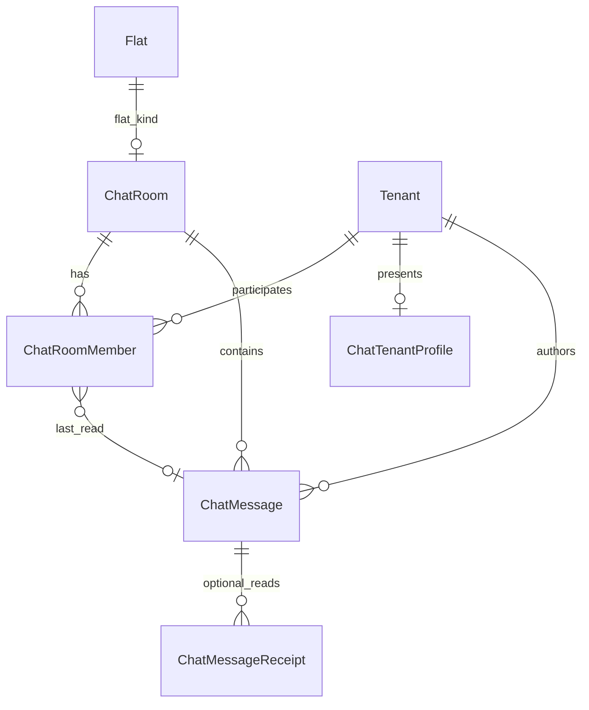
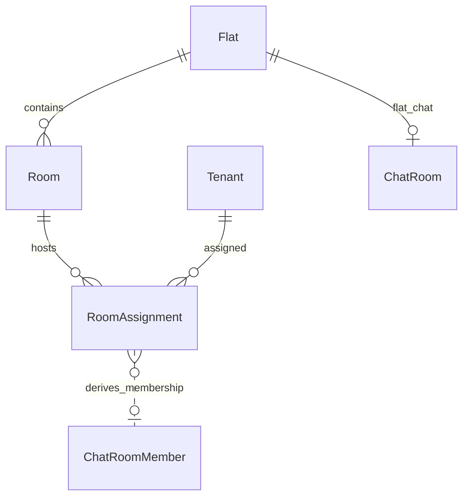

# Chat — database tables

This document declares relational tables **relevant to the Chat module**: purpose, primary and foreign keys, and integrity notes. It targets PostgreSQL and aligns with the [chat module specification](../specifications/chat.md) and [chat requirements](../requirements/chat.md). Column names in migrations may use equivalent snake_case.

---

## Scope

### Tables this module owns or primarily writes

Rooms (flat, direct, group), memberships, messages, per-tenant chat profiles, and optional message receipt rows.

### Tables this module reads or shares (boundaries)

| Area | Relationship |
|------|----------------|
| **Administration** | `Flat`, `Room`, `RoomAssignment`, `Tenant` drive flat-room provisioning and **derived** membership; administration does not own chat tables. |
| **Platform** | `User` (session principal), file storage for avatars, optional `AuditEvent`. |
| **Forum** | No shared tables; optional UX links only. |

---

## Identity (platform and administration)

Chat actions bind to authenticated **tenant** principals.

- **`author_tenant_id`** → `Tenant.id` on messages and profile rows.
- **`tenant_id`** on `ChatRoomMember` → `Tenant.id`.
- Session may also resolve **`user_id`** → `User.id` for audit; message attribution uses tenant id for tenant-facing labels.

Display name resolution: `COALESCE(ChatTenantProfile.nickname, Tenant.legal_full_name)` (exact tenant name column per administration schema).

---

## Rooms

### `ChatRoom`

| | |
|--|--|
| **Purpose** | Conversation container: flat channel, direct thread, or group chat. |
| **Primary key** | `id` |
| **Foreign keys** | **`flat_id`** → `Flat.id` (required when `kind = flat`, else null); optional **`created_by_tenant_id`** → `Tenant.id` (group/direct initiator). |
| **Suggested fields** | **`kind`** enum (`flat`, `direct`, `group`), **`name`** (group; flat may default from flat label), **`avatar_url`** or **`avatar_storage_key`** (group; optional flat icon), **`tenant_low_id`** / **`tenant_high_id`** → `Tenant.id` (direct only; `tenant_low_id < tenant_high_id`), **`last_message_at`**, **`last_message_preview`** (denormalized), **`created_at`**, **`updated_at`**, **`archived_at`** (nullable). |
| **Integrity** | **Flat:** unique on (`kind`, `flat_id`) where `kind = flat`. **Direct:** unique on (`tenant_low_id`, `tenant_high_id`) where `kind = direct`. **Group:** no flat/direct pair columns. |

**Maps to:** FR-CM-001, FR-CM-003, FR-CM-004, UC-CM-01–03, CM-001–003.

#### Kind discriminator

| `kind` | Key fields | Created by |
|--------|------------|------------|
| `flat` | `flat_id` | system (lazy on first assignment) |
| `direct` | `tenant_low_id`, `tenant_high_id` | system on first open |
| `group` | `name`, avatar | tenant creator |

---

## Membership

### `ChatRoomMember`

| | |
|--|--|
| **Purpose** | Tenant participation in a room, read cursor, and group roles. |
| **Primary key** | `id` |
| **Foreign keys** | **`room_id`** → `ChatRoom.id`, **`tenant_id`** → `Tenant.id`. |
| **Suggested fields** | **`role`** enum (`member`, `owner`) — owner for group creator; flat uses `member`, **`source`** enum (`derived`, `invited`) — flat rows use `derived`, **`joined_at`**, **`left_at`** (nullable = active), **`last_read_message_id`** → `ChatMessage.id` (nullable), **`last_read_at`**, **`created_at`**. |
| **Integrity** | At most one active row per (`room_id`, `tenant_id`) with `left_at IS NULL` (partial unique index). Flat membership must match assignment rule (application sync, not manual tenant edits). |

**Maps to:** FR-CM-002, FR-CM-004, FR-CM-008, CM-001, CM-003.

#### Flat membership note

Do not maintain a separate flatmate list in administration. Sync job or assignment hooks upsert/deactivate rows here from `RoomAssignment` + `Room.flat_id`.

---

## Messages

### `ChatMessage`

| | |
|--|--|
| **Purpose** | Persisted chat line in a room timeline. |
| **Primary key** | `id` |
| **Foreign keys** | **`room_id`** → `ChatRoom.id`, **`author_tenant_id`** → `Tenant.id`. |
| **Suggested fields** | **`body`** (text), **`client_message_id`** (UUID, idempotency), **`created_at`**, optional **`edited_at`**, **`deleted_at`** (soft delete). |
| **Integrity** | Unique on (`room_id`, `author_tenant_id`, `client_message_id`) for idempotent retry. Author must have active `ChatRoomMember` at insert time (transaction check). |

**Maps to:** FR-CM-007, FR-CM-009, CM-005.

> **Post-MVP:** `attachment_storage_key`, reply threading (`reply_to_message_id`).

---

## Profile

### `ChatTenantProfile`

| | |
|--|--|
| **Purpose** | Chat-specific presentation for a tenant (not replacing administration tenant legal record). |
| **Primary key** | `id` or **`tenant_id`** as PK |
| **Foreign keys** | **`tenant_id`** → `Tenant.id` (unique). |
| **Suggested fields** | **`nickname`** (nullable), **`bio`**, **`avatar_url`** or **`avatar_storage_key`**, **`updated_at`**. |
| **Integrity** | One profile row per tenant; create-on-first-edit acceptable. |

**Maps to:** FR-CM-006, CM-004.

---

## Read receipts (optional, v1+)

### `ChatMessageReceipt`

| | |
|--|--|
| **Purpose** | Per-message read tracking when product requires delivery ticks beyond cursor badges. |
| **Primary key** | `id` |
| **Foreign keys** | **`message_id`** → `ChatMessage.id`, **`tenant_id`** → `Tenant.id`. |
| **Suggested fields** | **`read_at`**. |
| **Integrity** | Unique on (`message_id`, `tenant_id`). |

**Maps to:** FR-CM-009 (optional); MVP may use `ChatRoomMember.last_read_message_id` only.

---

## Membership sync log (optional)

### `ChatMembershipSyncEvent`

| | |
|--|--|
| **Purpose** | Append-only trace of assignment-driven flat membership changes for debugging/backfill. |
| **Primary key** | `id` |
| **Foreign keys** | **`room_id`**, **`tenant_id`**, optional **`room_assignment_id`** → `RoomAssignment.id`. |
| **Suggested fields** | **`action`** (`joined`, `left`), **`occurred_at`**, **`trigger`** (assignment_created, assignment_ended, room_changed). |

Not required for core MVP if assignment hooks are reliable.

---

## Administration linkage (read-only)

### `Flat`, `Room`, `RoomAssignment`, `Tenant`

Chat reads these to provision flat rooms and sync membership:

```
RoomAssignment (active) → Room.flat_id → ChatRoom (kind=flat, flat_id)
```

| Administration table | Chat usage |
|------------------------|------------|
| `Flat` | 1:1 flat `ChatRoom` |
| `Room` | resolves flat from assignment |
| `RoomAssignment` | authoritative membership input |
| `Tenant` | legal name default, DM participant validity |

See [administration.md](administration.md).

---

## Audit

### `AuditEvent` (platform)

Emit for profile updates, group owner removals, and staff moderation when implemented, in addition to any domain-specific chat audit tables.

---

## Entity-relationship diagrams

### Chat core



### Chat and administration



---

## Indexing recommendations

| Table | Index | Rationale |
|-------|-------|-----------|
| `ChatRoom` | unique partial on (`flat_id`) WHERE `kind = 'flat'` | one flat room |
| `ChatRoom` | unique on (`tenant_low_id`, `tenant_high_id`) WHERE `kind = 'direct'` | one DM per pair |
| `ChatRoom` | `(last_message_at DESC)` | conversation list |
| `ChatRoomMember` | `(tenant_id)` partial `WHERE left_at IS NULL` | tenant’s active rooms |
| `ChatRoomMember` | unique `(room_id, tenant_id)` partial `WHERE left_at IS NULL` | active membership |
| `ChatMessage` | `(room_id, created_at DESC, id DESC)` | timeline pagination |
| `ChatMessage` | unique `(room_id, author_tenant_id, client_message_id)` | idempotent send |
| `ChatTenantProfile` | unique `(tenant_id)` | profile lookup |

---

## Example queries

### Unread count (cursor-based)

For member `m` in room `r`:

```sql
SELECT COUNT(*)::int
FROM chat_message msg
WHERE msg.room_id = m.room_id
  AND msg.author_tenant_id <> m.tenant_id
  AND (m.last_read_message_id IS NULL OR msg.id > m.last_read_message_id)
  AND msg.deleted_at IS NULL;
```

### Active flat members (derived check)

Tenants with active assignment in flat `F`:

```sql
SELECT DISTINCT ra.tenant_id
FROM room_assignment ra
JOIN room rm ON rm.id = ra.room_id
WHERE rm.flat_id = :flat_id
  AND ra.ended_at IS NULL;
```

---

## Related documents

- [Chat requirements](../requirements/chat.md)
- [Chat specification](../specifications/chat.md)
- [Administration database](administration.md) — `Flat`, `Room`, `RoomAssignment`
- [Database documentation index](README.md)
