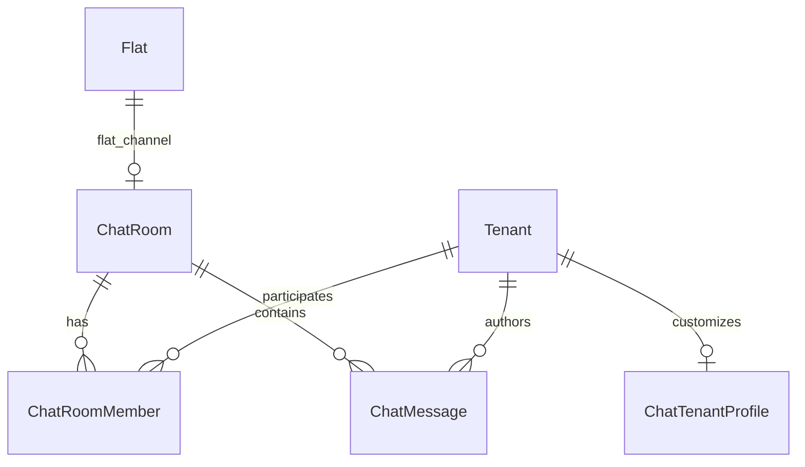

# Chat — database tables

This document declares relational tables **relevant to the Chat module**: purpose, primary and foreign keys, and integrity notes. It targets PostgreSQL and aligns with the [chat module specification](../specifications/chat.md) and [chat requirements](../requirements/chat.md). Column names in migrations may use equivalent snake_case.

---

## Scope

### Tables this module owns or primarily writes

- `ChatRoom`, `ChatRoomMember`, `ChatMessage`, `ChatTenantProfile`
- optional `ChatMembershipSyncLog` for assignment replay diagnostics

### Tables this module reads or shares (boundaries)

| Area | Relationship |
|------|----------------|
| **Administration** | `Flat`, `Room`, `RoomAssignment`, `Tenant` — authoritative for flat membership derivation and legal name default |
| **Platform** | `User` for staff diagnostics; `AuditEvent` for optional moderation; blob storage for avatars |
| **Forum** | No shared tables; UX may link to tenant profile routes only |

---

## Identity (platform + administration)

- Chat operations use authenticated **tenant** principals (`tenant_id`).
- `ChatMessage.author_tenant_id` → `Tenant.id`.
- Staff access (diagnostics/moderation) uses `User.id` when implemented.

---

## Rooms

### `ChatRoom`

| | |
|--|--|
| **Purpose** | Conversation container: flat (system), direct (pair), or group (user-created). |
| **Primary key** | `id` |
| **Foreign keys** | optional `flat_id` → `Flat.id` when `kind = flat` |
| **Suggested fields** | `kind` enum (`flat`, `direct`, `group`), `title`, `avatar_url` or storage key, `tenant_low_id` / `tenant_high_id` for direct rooms, `last_message_at`, `last_message_preview`, timestamps |
| **Integrity** | At most one row with `kind = flat` per `flat_id`; at most one direct room per canonical tenant pair |

**Maps to:** FR-CM-001, FR-CM-003, FR-CM-004, UC-CM-01–03.

#### Direct room canonical pair

Store `tenant_low_id` and `tenant_high_id` with CHECK `tenant_low_id < tenant_high_id` and unique index on the pair.

---

## Membership

### `ChatRoomMember`

| | |
|--|--|
| **Purpose** | Tenant membership in a room, read cursor, and leave state. |
| **Primary key** | `id` |
| **Foreign keys** | `room_id` → `ChatRoom.id`, `tenant_id` → `Tenant.id` |
| **Suggested fields** | `role` enum (`member`, `owner` for groups), `joined_at`, `left_at` (nullable), `last_read_message_id` (nullable FK → `ChatMessage.id`), `source` enum (`derived`, `invited`, `created`) |
| **Integrity** | At most one active member per (`room_id`, `tenant_id`) where `left_at IS NULL`; flat members are derived-only in v1 |

**Maps to:** FR-CM-002, FR-CM-008, I-CM-02.

---

## Messages

### `ChatMessage`

| | |
|--|--|
| **Purpose** | Persisted chat message in a room. |
| **Primary key** | `id` |
| **Foreign keys** | `room_id` → `ChatRoom.id`, `author_tenant_id` → `Tenant.id` |
| **Suggested fields** | `body` text, `created_at`, optional `edited_at`, optional `deleted_at`, `client_message_id` for idempotency |
| **Integrity** | Unique (`room_id`, `author_tenant_id`, `client_message_id`) when idempotency key supplied; ordering by (`created_at`, `id`) |

**Maps to:** FR-CM-007, FR-CM-009, NFR-CM-004.

---

## Profile

### `ChatTenantProfile`

| | |
|--|--|
| **Purpose** | Per-tenant chat display overrides. |
| **Primary key** | `tenant_id` (or surrogate `id` with unique `tenant_id`) |
| **Foreign keys** | `tenant_id` → `Tenant.id` |
| **Suggested fields** | `nickname` (nullable), `bio`, `avatar_storage_key`, `updated_at` |
| **Integrity** | One profile row per tenant; display nickname falls back to administration `Tenant` legal name |

**Maps to:** FR-CM-006, CM-004.

---

## Optional diagnostics

### `ChatMembershipSyncLog`

| | |
|--|--|
| **Purpose** | Record assignment-driven sync runs for support replay (optional). |
| **Suggested fields** | `tenant_id`, `flat_id`, `event_type`, `applied_at`, `payload` jsonb |

---

## Cross-Module Dependencies

| Source module | Trigger | Chat effect |
|---------------|---------|-------------|
| Administration | `RoomAssignment` created with active row | Ensure flat `ChatRoom` exists; add `ChatRoomMember` if tenant now in flat |
| Administration | Assignment ended or room changed | Remove or move flat membership (`left_at`) |
| Platform | Tenant session | All reads/writes scoped to principal `tenant_id` |
| Platform | `chat.message.created` event | Optional `InAppNotification` for offline peers |

Administration must **not** insert into `ChatRoomMember` directly; chat module owns membership rows and sync handler.

---

## Entity-relationship diagram (conceptual)

---

## Indexing recommendations

| Table | Index | Rationale |
|-------|-------|-----------|
| `ChatMessage` | `(room_id, created_at DESC)` | timeline pagination |
| `ChatRoomMember` | `(tenant_id)` partial `WHERE left_at IS NULL` | conversation list |
| `ChatRoom` | unique `(flat_id)` where `kind = flat` | one flat room |
| `ChatRoom` | unique `(tenant_low_id, tenant_high_id)` where `kind = direct` | one DM thread |

---

## Related documents

- [Chat requirements](../requirements/chat.md)
- [Chat specification](../specifications/chat.md)
- [Administration database](administration.md) — `Flat`, `Room`, `RoomAssignment`, `Tenant`
- [Platform database](platform.md)
- [Database documentation index](README.md)
