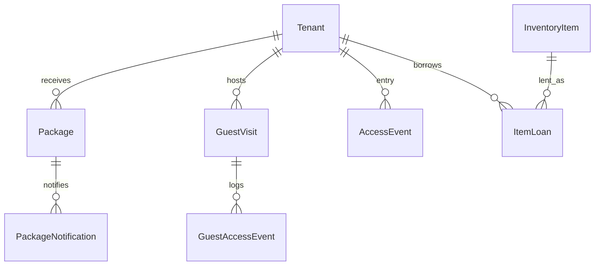

# Doorman — database tables

This document declares relational tables **relevant to the Doorman module**: purpose, primary and foreign keys, and integrity notes. It targets PostgreSQL and aligns with the [doorman module specification](../specifications/doorman.md) and [doorman requirements](../requirements/doorman.md). Column names in migrations may use equivalent snake_case.

---

## Scope

### Tables this module owns or primarily writes

Operational records for **packages**, **guest visits**, **entry/access events** (including QR), and **item loans** (keys and activity accessories). Exact table names are implementation choices; the lists below use descriptive names.

### Tables this module reads or shares (boundaries)

| Area | Relationship |
|------|----------------|
| **Administration** | `Tenant`, and optionally `Room` context for display; `InventoryItem` for lendable stock definitions and status mirrored on loan checkout/return. |
| **Platform** | `User` for doorman actor on every mutation; `AuditEvent` for sensitive actions. |
| **Notifications / Forum** | Optional linkage from package notification rows to tenant-visible feeds (not owned by doorman schema beyond foreign keys). |

---

## Identity (platform)

Doorman operations are performed by authenticated **staff** users (role **Doorman**, or as defined in platform RBAC).

- Foreign keys: `created_by_user_id`, `actor_user_id`, `doorman_user_id` should reference `User.id` (or equivalent stable identity table).

---

## Package handling

### `Package` (or `Parcel`)

| | |
|--|--|
| **Purpose** | Single inbound delivery record from intake through pickup. |
| **Primary key** | `id` |
| **Foreign keys** | **`tenant_id`** → `Tenant.id` (nullable when unidentified); optional **`registered_by_user_id`** → `User.id`. |
| **Suggested fields** | recipient label text, package type or description, **`received_at`**, **`status`** enum (`received`, `notified`, `picked_up`), **`picked_up_at`**, **`picked_up_by_user_id`**. |
| **Integrity** | Status transitions must match application state machine; `picked_up_at` set only when status is terminal pickup. |

**Maps to:** DM-001, UC-DM-01, FR-DM-001 – FR-DM-003.

### `PackageNotification` (optional separate table)

| | |
|--|--|
| **Purpose** | Append-only log of outbound tenant notifications for packages (supports retry and auditing). |
| **Primary key** | `id` |
| **Foreign keys** | **`package_id`** → `Package.id`, **`tenant_id`** → `Tenant.id`. |
| **Suggested fields** | **`channel`** (in_app, email, …), **`status`**, **`sent_at`**, **`failure_reason`**. |

**Maps to:** DM-002, FR-DM-004, FR-DM-005.

---

## Guest access

### `GuestVisit` (or `GuestAccess`)

| | |
|--|--|
| **Purpose** | Planned or active guest visit bound to a host tenant and approval window. |
| **Primary key** | `id` |
| **Foreign keys** | **`host_tenant_id`** → `Tenant.id`; optional **`registered_by_user_id`** → `User.id`. |
| **Suggested fields** | guest name, ID notes, **`valid_from`**, **`valid_to`**, **`status`** (`scheduled`, `checked_in`, `checked_out`, `denied` if modeling terminal denial on row). |

**Maps to:** DM-003, UC-DM-02, FR-DM-006.

### `GuestAccessEvent` (recommended)

| | |
|--|--|
| **Purpose** | Append-only log of check-in, check-out, and denial events with actor and time. |
| **Primary key** | `id` |
| **Foreign keys** | **`guest_visit_id`** → `GuestVisit.id`; **`actor_user_id`** → `User.id`. |
| **Suggested fields** | **`event_type`** (`check_in`, `check_out`, `denied`), **`occurred_at`**, **`reason`** (for example `outside_visit_window`). |

**Maps to:** FR-DM-007.

---

## QR and entry validation

### `TenantEntryToken` (optional, if QR maps to stored token)

| | |
|--|--|
| **Purpose** | Rotating or static token material used to validate printed/app QR codes. |
| **Primary key** | `id` |
| **Foreign keys** | **`tenant_id`** → `Tenant.id` (or **`user_id`** if QR bound to login identity). |
| **Suggested fields** | secret hash or public token id, **`expires_at`**, **`revoked_at`**. |

### `AccessEvent`

| | |
|--|--|
| **Purpose** | Immutable log of every entry attempt (success or failure). |
| **Primary key** | `id` |
| **Foreign keys** | optional **`tenant_id`**; optional **`actor_user_id`** (doorman confirming); optional **`token_id`**. |
| **Suggested fields** | **`outcome`** (`granted`, `denied`), **`reason`**, **`occurred_at`**, optional **`source`** (`qr_scan`, `manual`). |

**Maps to:** DM-004, UC-DM-04, FR-DM-008, FR-DM-009.

---

## Accessory and key lending

### `ItemLoan` (or `AccessoryLoan`)

| | |
|--|--|
| **Purpose** | Checkout/return of a lendable unit to a tenant. |
| **Primary key** | `id` |
| **Foreign keys** | **`tenant_id`** → `Tenant.id`; **`inventory_item_id`** → `InventoryItem.id` (administration-owned catalog); **`checked_out_by_user_id`**, **`returned_by_user_id`** → `User.id`. |
| **Suggested fields** | **`checked_out_at`**, **`expected_return_at`**, **`returned_at`**, optional **`notes`**. |
| **Integrity** | At most one open loan per lendable unit if inventory is single-quantity; enforce in app or partial unique index on (`inventory_item_id`) where `returned_at IS NULL`. |

**Maps to:** DM-005, UC-DM-03, FR-DM-010, FR-DM-011.

---

## Audit

### `AuditEvent` (platform)

Sensitive doorman actions (guest denial, QR denial, forced package transition) should emit **`AuditEvent`** in addition to domain-specific event rows.

---

## Entity-relationship diagram (conceptual)

---

## Related documents

- [Doorman requirements](../requirements/doorman.md)
- [Doorman specification](../specifications/doorman.md)
- [Database documentation index](README.md)
