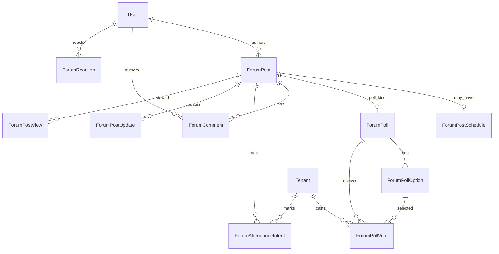
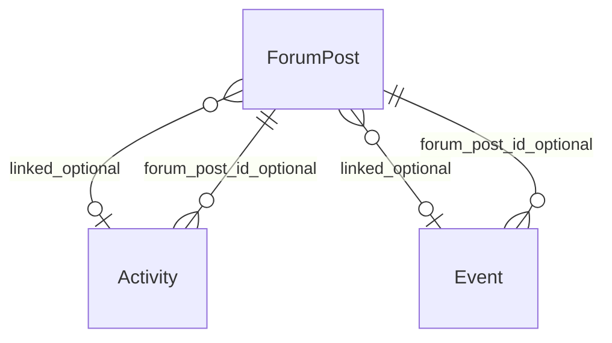

# Forum — database tables

This document declares relational tables **relevant to the Forum module**: purpose, primary and foreign keys, and integrity notes. It targets PostgreSQL and aligns with the [forum module specification](../specifications/forum.md) and [forum requirements](../requirements/forum.md). Column names in migrations may use equivalent snake_case.

---

## Scope

### Tables this module owns or primarily writes

Feed posts, polls and votes, comments, reactions, attendance intents, optional view analytics, and moderation history for tenant-facing communication.

### Tables this module reads or shares (boundaries)

| Area | Relationship |
|------|----------------|
| **Administration** | Official news/activities/events are **published** in administration workflows and represented as `ForumPost` (or linked via `activity_id` / `event_id`). Administration owns draft/publish lifecycle; forum owns tenant engagement children. |
| **Platform** | `User`, `Tenant`, RBAC, and `AuditEvent` for actors and sensitive actions. |
| **Doorman / notifications** | Optional `kind = system_notice` posts or notification fan-in; not required for core schema. |

---

## Identity (platform)

Forum actions bind to authenticated **tenant** or **staff** users.

- **`author_user_id`** → `User.id` for all authored content.
- **`tenant_id`** on votes, attendance, and optional community authorship context → `Tenant.id`.
- Staff moderation uses **`moderator_user_id`** → `User.id`.

---

## Core feed: posts

### `ForumPost`

| | |
|--|--|
| **Purpose** | Single feed item: official news, community activity, event, poll wrapper, or announcement. |
| **Primary key** | `id` |
| **Foreign keys** | **`author_user_id`** → `User.id`; optional **`author_tenant_id`** → `Tenant.id` (community posts); optional **`activity_id`** → `Activity.id`; optional **`event_id`** → `Event.id` (administration-owned, when modeled separately). |
| **Suggested fields** | **`kind`** enum (`official_news`, `community_activity`, `event`, `poll`, `announcement`, `system_notice`), **`title`**, **`body`** (text/markdown), **`state`** enum (`draft`, `published`, `archived`, `canceled`, `postponed`, `hidden`), **`source`** enum (`forum`, `administration`), **`published_at`**, **`pinned_at`** (nullable), **`pin_priority`** (int, default 0), **`tags`** (text array or join table), **`created_at`**, **`updated_at`**. |
| **Integrity** | Tenant default feed: `state = published` AND `state <> hidden` (or `moderation_state` clear). Official posts from administration use `source = administration`. |

**Maps to:** FR-FM-001, FR-FM-004, UC-FM-01, FM-001.

#### Kind discriminator

Use **`kind`** rather than separate top-level tables so the unified feed is a single indexed query. Type-specific data lives in extension tables or nullable columns below.

---

### `ForumPostSchedule` (extension, optional separate table)

| | |
|--|--|
| **Purpose** | Time and place metadata for activities and events. |
| **Primary key** | `id` or use **`forum_post_id`** as PK/FK |
| **Foreign keys** | **`forum_post_id`** → `ForumPost.id` (1:1). |
| **Suggested fields** | **`starts_at`**, **`ends_at`**, **`location`**, **`capacity`** (nullable), **`registration_deadline`** (nullable). |

**Maps to:** FR-FM-003, FR-FM-004, FM-002, FM-003.

> **Alternative:** embed schedule columns on `ForumPost` when all timed kinds share the same shape; split only if community vs official schedules diverge significantly.

---

### `ForumPostUpdate` (organizer updates)

| | |
|--|--|
| **Purpose** | Chronological updates on an official event/activity post. |
| **Primary key** | `id` |
| **Foreign keys** | **`parent_post_id`** → `ForumPost.id`; **`author_user_id`** → `User.id`. |
| **Suggested fields** | **`body`**, **`created_at`**. |

**Maps to:** FR-FM-006, FM-003 acceptance (event updates).

---

## Polling

### `ForumPoll`

| | |
|--|--|
| **Purpose** | Poll configuration bound 1:1 to a `ForumPost` with `kind = poll`. |
| **Primary key** | `id` |
| **Foreign keys** | **`forum_post_id`** → `ForumPost.id` (unique). |
| **Suggested fields** | **`choice_mode`** (`single`, `multiple`), **`results_visibility`** (`live`, `post_close`), **`closes_at`**, **`eligibility`** (enum or JSON policy), **`created_by_user_id`**. |

**Maps to:** FR-FM-007 – FR-FM-009, UC-FM-02, FM-004.

### `ForumPollOption`

| | |
|--|--|
| **Purpose** | Answer choice for a poll. |
| **Primary key** | `id` |
| **Foreign keys** | **`poll_id`** → `ForumPoll.id`. |
| **Suggested fields** | **`label`**, **`sort_order`**. |
| **Integrity** | At least two options per poll (application check on create). |

### `ForumPollVote`

| | |
|--|--|
| **Purpose** | Immutable tenant vote row(s). |
| **Primary key** | `id` |
| **Foreign keys** | **`poll_id`** → `ForumPoll.id`, **`option_id`** → `ForumPollOption.id`, **`tenant_id`** → `Tenant.id`. |
| **Suggested fields** | **`voted_at`**. |
| **Integrity** | **Single-choice:** partial unique index on (`poll_id`, `tenant_id`). **Multiple-choice:** unique on (`poll_id`, `tenant_id`, `option_id`). Reject inserts when `now > closes_at`. |

**Maps to:** FR-FM-008, UC-FM-02.

---

## Engagement

### `ForumComment`

| | |
|--|--|
| **Purpose** | Threaded discussion on a post. |
| **Primary key** | `id` |
| **Foreign keys** | **`post_id`** → `ForumPost.id`; **`author_user_id`** → `User.id`; optional **`parent_comment_id`** → `ForumComment.id`. |
| **Suggested fields** | **`body`**, **`created_at`**, **`edited_at`**, **`deleted_at`** (soft delete), **`moderation_state`** (`visible`, `hidden`, `removed`). |

**Maps to:** FR-FM-011, FM-001, FM-005.

### `ForumReaction`

| | |
|--|--|
| **Purpose** | Like (or future reaction types) on a post or comment. |
| **Primary key** | `id` |
| **Foreign keys** | **`user_id`** → `User.id`. |
| **Suggested fields** | **`target_type`** (`post`, `comment`), **`target_id`** (polymorphic UUID; enforce via application or separate nullable FK columns), **`reaction_type`** (default `like`), **`created_at`**. |
| **Integrity** | Unique on (`target_type`, `target_id`, `user_id`, `reaction_type`). |

**Maps to:** FR-FM-010, FM-005.

> **Alternative:** split into `ForumPostReaction` and `ForumCommentReaction` tables for stricter FK enforcement.

---

## Events and activities: attendance

### `ForumAttendanceIntent`

| | |
|--|--|
| **Purpose** | Tenant going / not-going intent for activity or event posts. |
| **Primary key** | `id` |
| **Foreign keys** | **`post_id`** → `ForumPost.id`, **`tenant_id`** → `Tenant.id`. |
| **Suggested fields** | **`intent`** enum (`going`, `not_going`), **`updated_at`**. |
| **Integrity** | Unique on (`post_id`, `tenant_id`) for current intent (upsert on change). |

**Maps to:** FR-FM-005, UC-FM-03, FM-002, FM-003.

---

## Analytics (optional)

### `ForumPostView`

| | |
|--|--|
| **Purpose** | Record detail views for analytics (UC-FM-01). |
| **Primary key** | `id` |
| **Foreign keys** | **`post_id`** → `ForumPost.id`; **`viewer_user_id`** or **`viewer_tenant_id`**. |
| **Suggested fields** | **`viewed_at`**. |
| **Integrity** | Dedup policy is product choice (one row per viewer per day vs append-only). |

**Maps to:** FR-FM-002, UC-FM-01 postconditions.

---

## Moderation

### `ForumModerationAction`

| | |
|--|--|
| **Purpose** | Append-only staff actions on posts or comments. |
| **Primary key** | `id` |
| **Foreign keys** | **`moderator_user_id`** → `User.id`. |
| **Suggested fields** | **`target_type`** (`post`, `comment`), **`target_id`**, **`action`** (`hide`, `restore`, `remove`), **`reason`**, **`occurred_at`**. |

**Maps to:** FR-FM-012, FR-FM-016, FM-005.

Also set **`ForumPost.state`** or **`moderation_state`** on the target row when action applies.

---

## Administration linkage

Administration may publish without duplicating content shape:

| Pattern | Description |
|---------|-------------|
| **A (preferred)** | Administration publish upserts **`ForumPost`** with `source = administration`, `kind` set appropriately, and optional FK to **`Activity`** / **`Event`**. |
| **B** | `Activity.forum_post_id` / `Event.forum_post_id` points to forum-owned post (see [administration.md](administration.md)). |

Engagement tables (`ForumComment`, `ForumReaction`, `ForumAttendanceIntent`, poll votes) always hang off **`ForumPost.id`**.

### `Activity` / `Event` (administration-owned, read by forum)

Forum reads these for organizer dashboards and capacity/deadline display when not fully denormalized onto `ForumPostSchedule`.

---

## Audit

### `AuditEvent` (platform)

Emit for moderation, poll administration overrides, and privileged visibility changes, in addition to **`ForumModerationAction`** domain history.

---

## Entity-relationship diagrams

### Forum core

### Forum and administration

---

## Indexing recommendations

| Table | Index | Rationale |
|-------|-------|-----------|
| `ForumPost` | `(state, published_at DESC)` partial `WHERE state = 'published'` | feed |
| `ForumPost` | `(pinned_at, pin_priority DESC)` partial `WHERE pinned_at IS NOT NULL` | pinned-first sort |
| `ForumComment` | `(post_id, created_at)` | thread load |
| `ForumPollVote` | `(poll_id)` | result aggregation |
| `ForumAttendanceIntent` | `(post_id)` | organizer counts |
| `ForumReaction` | `(target_type, target_id)` | reaction counts |

---

## Related documents

- [Forum requirements](../requirements/forum.md)
- [Forum specification](../specifications/forum.md)
- [Administration database](administration.md) — publication linkage
- [Database documentation index](README.md)
