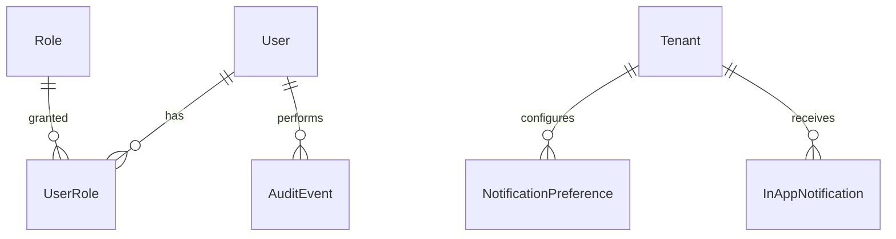

# Platform — database tables

This document declares relational tables **owned by the platform layer**: identity, RBAC, audit, notification preferences, and in-app notification delivery. It targets PostgreSQL and aligns with [platform requirements](../requirements/platform.md) and [platform specification](../specifications/platform.md). Column names in migrations may use equivalent snake_case.

---

## Scope

### Tables this layer owns or primarily writes

- `User`, `Role`, `UserRole`
- `AuditEvent`
- `NotificationPreference`
- `InAppNotification` (or `Notification`)

### Tables this layer reads (boundaries)

| Area | Relationship |
|------|----------------|
| **Administration** | `Tenant` linkage for tenant principals; audit targets reference administration entities by `target_type` + `target_id` |
| **Doorman** | Package notification domain rows remain doorman-owned; platform may mirror delivery outcome |
| **Forum / Chat** | Optional foreign keys in notification payload JSON only; no forum/chat FK required on core platform tables |

---

## Identity and RBAC

### `User`

| | |
|--|--|
| **Purpose** | Authenticated identity for staff and tenants. |
| **Primary key** | `id` |
| **Suggested fields** | `uni_code` (unique), `email`, `password_hash`, `name`, `principal_type` enum (`staff`, `tenant`), `is_active`, `last_login_at`, timestamps |
| **Integrity** | `email` unique per deployment policy; inactive users cannot authenticate |

**Maps to:** FR-CC-002, implementation in `internal/models/administration/user.go` (migrated with administration models).

### `Role`

| | |
|--|--|
| **Purpose** | Named role catalog (`administrator`, `office_worker`, `doorman`, `tenant`, …). |
| **Primary key** | `id` |
| **Suggested fields** | `name` (unique), `description` |

### `UserRole`

| | |
|--|--|
| **Purpose** | Assignment of roles to users with optional revocation. |
| **Primary key** | `id` |
| **Foreign keys** | `user_id` → `User.id`, `role_id` → `Role.id`, optional `assigned_by` → `User.id` |
| **Suggested fields** | `assigned_at`, `revoked_at` (nullable) |
| **Integrity** | Unique active assignment per (`user_id`, `role_id`) where `revoked_at IS NULL` |

**Maps to:** FR-CC-001, CC-001.

### Tenant linkage

Tenants typically reference `User` via administration `Tenant` row (`user_id` → `User.id`) or shared principal record — exact shape is administration-owned; platform authorization resolves `tenant_id` after authentication.

---

## Audit

### `AuditEvent`

| | |
|--|--|
| **Purpose** | Append-only cross-module log of sensitive actions. |
| **Primary key** | `id` |
| **Foreign keys** | optional `actor_user_id` → `User.id` |
| **Suggested fields** | `action` (indexed), `target_type`, `target_id`, `outcome` enum (`success`, `failure`), `metadata` (text/json), `occurred_at` |
| **Integrity** | No in-place updates in application paths; search indexed by time and actor |

**Maps to:** FR-CC-003, CC-002. Current implementation: `internal/models/administration/audit.go` (treat as platform table).

---

## Notifications

### `NotificationPreference`

| | |
|--|--|
| **Purpose** | Per-tenant opt-in/out for non-critical notification categories. |
| **Primary key** | `id` or composite (`tenant_id`, `category`) |
| **Foreign keys** | `tenant_id` → `Tenant.id` |
| **Suggested fields** | `category` enum (`package`, `event`, `chat`, `safety`, …), `enabled` boolean, `updated_at` |
| **Integrity** | `safety` (or equivalent critical category) always `enabled = true` at application layer |

**Maps to:** FR-CC-005, CC-003.

### `InAppNotification`

| | |
|--|--|
| **Purpose** | Delivered or pending in-app notification row for a tenant. |
| **Primary key** | `id` |
| **Foreign keys** | `tenant_id` → `Tenant.id` |
| **Suggested fields** | `category`, `title`, `body`, `payload` jsonb, `deep_link`, `read_at` (nullable), `created_at`, `delivery_status` |
| **Integrity** | Idempotent insert on (`source_event_id`, `tenant_id`) when event sourcing is used |

**Maps to:** FR-CC-006, UC-CC-02.

---

## Cross-Module Dependencies

| Consumer module | Platform tables used | Notes |
|-----------------|----------------------|-------|
| Administration | `User`, `UserRole`, `AuditEvent` | Staff auth; assignment and ticket audits |
| Doorman | `User`, `UserRole`, `AuditEvent` | Doorman role; package/guest/access audits |
| Forum | `User`, `Tenant` (via admin), `AuditEvent` | Tenant/staff auth; moderation audit |
| Chat | `User`, `Tenant`, `AuditEvent` | Tenant auth; optional moderation audit |
| All | `Authorize` + `AuditEvent` | No module duplicates RBAC catalog |

Event fan-in (logical, may be application-level rather than FK):

- Doorman `PackageNotification` → platform in-app delivery
- Forum `event.updated` / `poll.closed` → `InAppNotification`
- Chat `chat.message.created` → `InAppNotification` when preference allows

---

## Entity-relationship diagram (conceptual)

---

## Indexing recommendations

| Table | Index | Rationale |
|-------|-------|-----------|
| `AuditEvent` | `(occurred_at DESC)` | audit search |
| `AuditEvent` | `(actor_user_id, occurred_at DESC)` | per-actor history |
| `AuditEvent` | `(action, occurred_at DESC)` | action filter |
| `UserRole` | `(user_id)` partial `WHERE revoked_at IS NULL` | active roles |
| `InAppNotification` | `(tenant_id, created_at DESC)` | tenant inbox |

---

## Related documents

- [Platform requirements](../requirements/platform.md)
- [Platform specification](../specifications/platform.md)
- [Administration database](administration.md) — `Tenant`, publication entities
- [Database documentation index](README.md)
